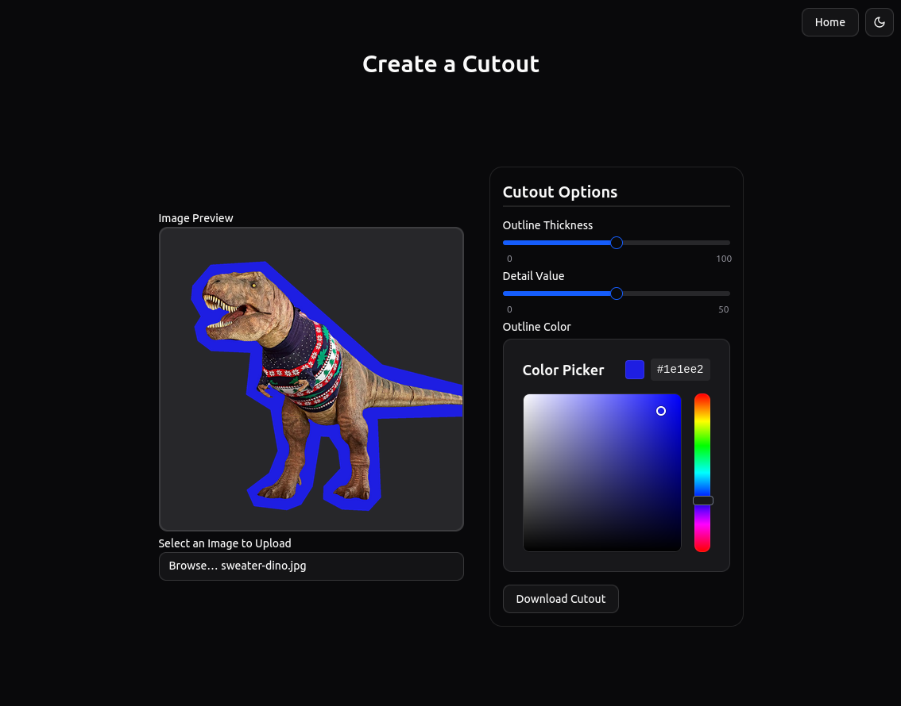

# Cutout Photos — Background removal + paper cutout effect

Turn any photo into a stylized “scissor-cut” paper cutout with a colored outline and transparent background.



## Features
- Automatic background removal (rembg + ONNX runtime)
- Paper cutout effect:
  - Outline thickness
  - Detail level (edge complexity)
  - Outline color (hex)
- FastAPI backend returns a ready-to-download PNG
- Svelte frontend for live preview and download
- Optional CLI for one-off processing

## How it works (Architecture)
- Frontend: Svelte + Vite (dev server on http://localhost:5173)
- Backend: FastAPI (dev server on http://127.0.0.1:8000)
- Pipeline: PIL, rembg, OpenCV/NumPy, and a custom paper cutout effect
- The frontend posts a multipart/form-data request to the backend and shows the processed PNG result

Key files:
- Backend app: `backend/main.py`
- Image pipeline: `backend/core/processor.py`
- Frontend route: `frontend/src/routes/+page.svelte`

## Quickstart

Prerequisites
- Python 3.10+ recommended
- Node.js 18+ and npm

1) Backend (FastAPI)
- Create and activate a virtual environment:
  - `python -m venv .venv && source .venv/bin/activate`
- Install dependencies:
  - `pip install -r requirements.txt`
- Run the API (default: 127.0.0.1:8000):
  - `uvicorn backend.main:app --reload`

2) Frontend (Svelte)
- Install dependencies:
  - `cd frontend && npm install`
- Run the dev server (http://localhost:5173):
  - `npm run dev`

Open http://localhost:5173. The frontend calls the backend at http://127.0.0.1:8000. CORS is configured to allow http://localhost:5173 during development.

Optional (Frontend build)
- Production build: `npm run build`
- Preview the build: `npm run preview`

## API

POST /api/upload
- Description: Remove background and apply the paper cutout effect. Returns a PNG.
- Content-Type: `multipart/form-data`
- Fields:
  - `file` (required): image file
  - `outline_thickness` (required, int): thickness of the outline
  - `detail` (required, int): higher values yield more polygonal edges
  - `outline_color` (required, str): hex color for the outline (e.g. `#0000FF`)
- Response:
  - 200 OK: binary PNG image with headers:
    - `Content-Type: image/png`
    - `Content-Disposition: attachment; filename="..."; filename*=UTF-8''...`
    - `X-Original-Size: WxH`
    - `X-File-Size: bytes`
  - 400 Bad Request: missing/not-an-image
  - 413 Payload Too Large: file > 10 MB
  - 500 Internal Server Error: processing failure

Example (curl)
```
curl -X POST http://127.0.0.1:8000/api/upload \
  -F "file=@examples/input/giraffe.jpg" \
  -F "outline_thickness=50" \
  -F "detail=25" \
  -F "outline_color=#0000FF" \
  --output giraffe-cutout.png
```

## CLI usage

For quick one-off processing in the terminal:

```
python main.py INPUT_PATH OUTPUT_PATH \
  -o 50 \
  -d 25 \
  -b "#0000FF"
```

- `INPUT_PATH`: source image (e.g. `examples/input/giraffe.jpg`)
- `OUTPUT_PATH`: destination image (PNG recommended to preserve transparency)
- `-o/--outline_thickness`: outline thickness (default: 15)
- `-d/--detail`: edge complexity (default: 25)
- `-b/--background_color`: outline hex color (default: `#FFFFFF`)

Examples
```
# Basic
python main.py examples/input/giraffe.jpg examples/output/giraffe-cutout.png

# Custom outline
python main.py -o 25 -d 50 -b "#FF0000" \
  examples/input/giraffe.jpg examples/output/giraffe-cutout.png
```

## Examples

Sample files:
- Input: `examples/input/giraffe.jpg`
- Output (you can place results here): `examples/output/`

Try the API with the curl example above or use the CLI.

## Troubleshooting

- CORS errors:
  - Ensure backend is at `http://127.0.0.1:8000` and frontend is at `http://localhost:5173`.
  - Backend CORS allowlist includes `http://localhost:5173` by default (see `backend/main.py`).
- File too large:
  - The backend enforces a 10 MB limit (`413` error).
- Invalid file type:
  - Only images are accepted (`400` error). The backend checks `Content-Type`.
- ONNX/model initialization:
  - First run may be slower due to model load. Subsequent requests are faster.
- Ports/hosts:
  - To change the backend host/port, pass `--host`/`--port` to uvicorn and adjust the frontend `API_BASE` in `frontend/src/routes/+page.svelte`.

## Tech stack

- Backend: FastAPI, uvicorn, pillow, rembg, onnxruntime, opencv-python-headless, numpy, scipy
- Frontend: Svelte, Vite, TypeScript, Tailwind CSS

## License

MIT — update to your preferred license as needed.
